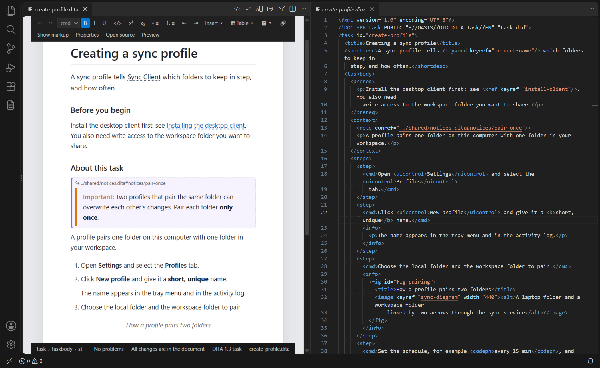
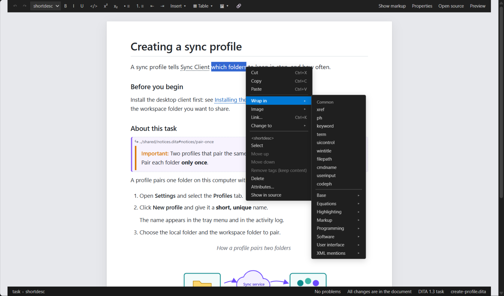
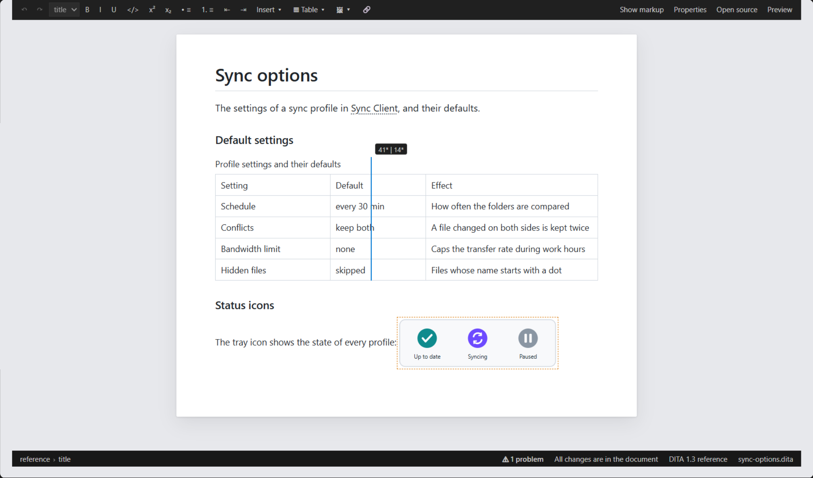
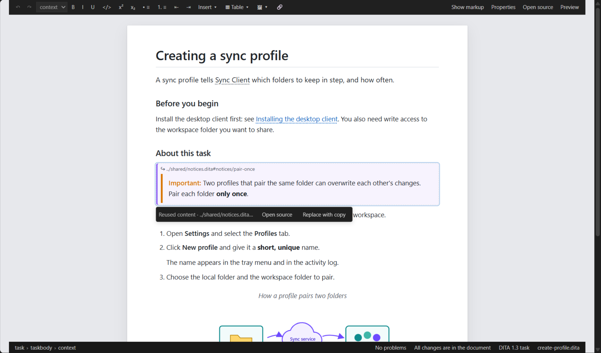
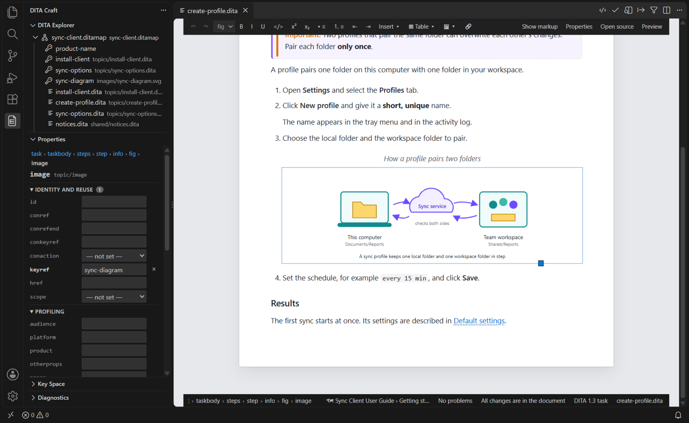
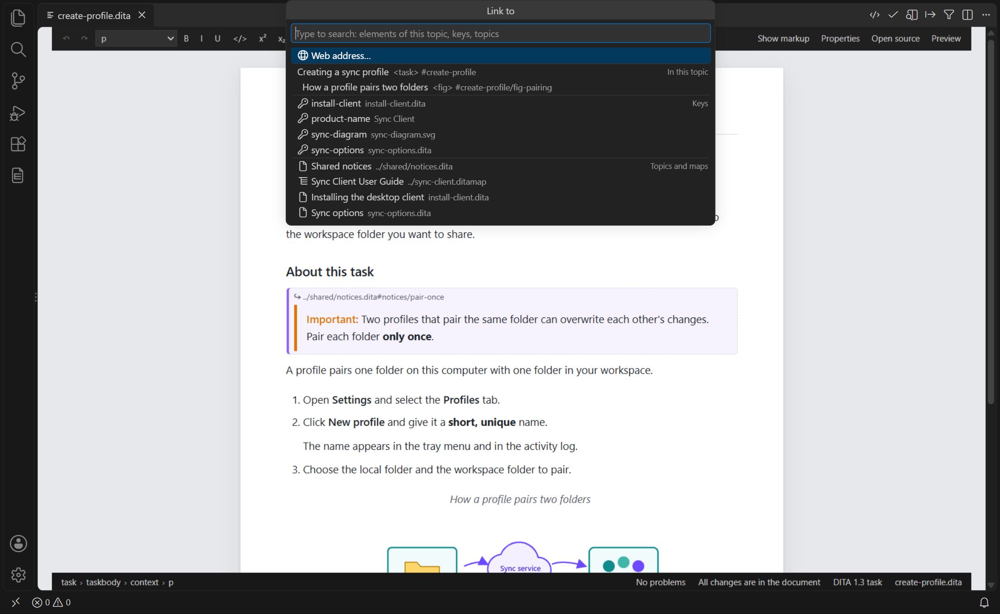
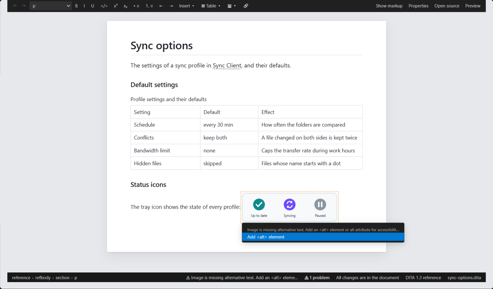
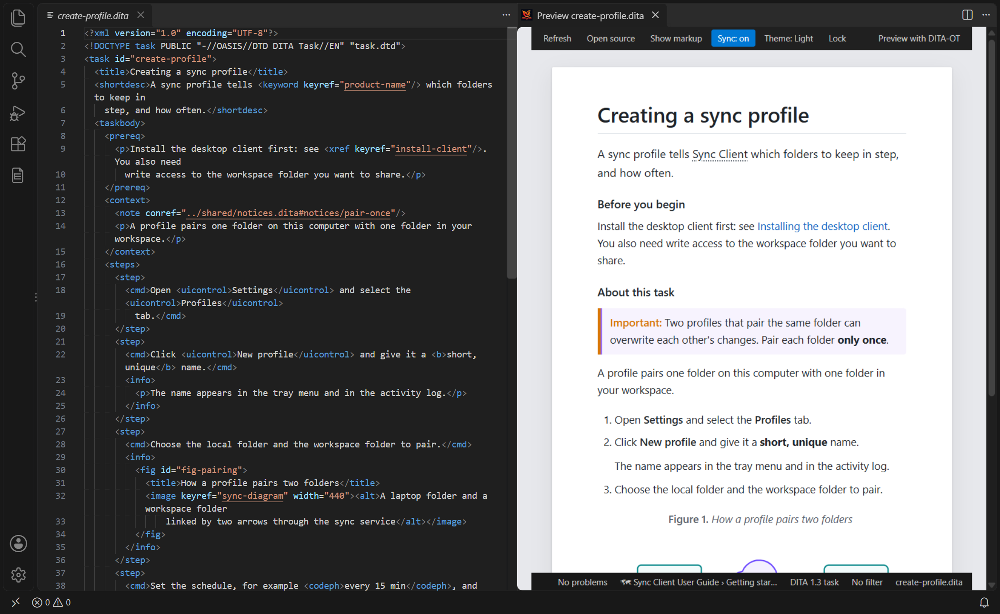
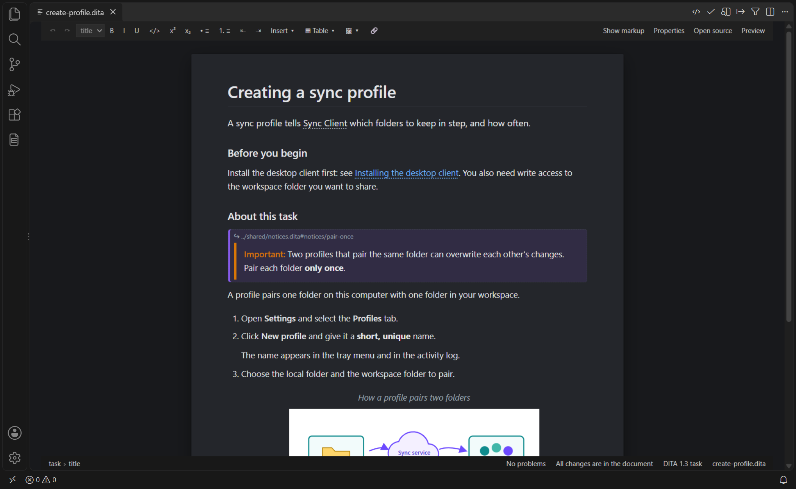

# DITA Craft

**The easiest way to edit and publish your DITA files**

[](https://code.visualstudio.com/)
[](LICENSE)
[](https://github.com/jyjeanne/ditacraft/actions/workflows/ci.yml)
[](CHANGELOG.md)

DITA Craft is a comprehensive Visual Studio Code extension for editing and publishing DITA (Darwin Information Typing Architecture) content. It provides syntax highlighting, real-time validation, smart navigation, AI-powered assistance, an MCP server for external AI agents, and seamless integration with DITA-OT for multi-format publishing. And now a **visual editor**: edit your topics on a formatted page — tables, images, links, reused content, problems and quick fixes included — and your maps and bookmaps as rows that show each topic's title, while DITA Craft keeps your DITA content clean, with a live **visual preview** and a **Properties view** for attributes.



*The visual editor (left) and the DITA topic (right): each change on the page is one small edit of the XML, and the two cursors follow each other.*

## ✨ New: the visual editor

Open a topic or a map with **DITA: Open in Visual Editor** — or right-click its tab → **Reopen Editor With…** → **DITA Visual Editor**. Every change reaches the file as a small text edit, so undo, save, Git diffs, validation and publishing work exactly as with the text editor.

### Your page and your XML, side by side

- **Write naturally** — Enter starts the next paragraph, list item or step; Tab nests lists; `Ctrl+B`, `Ctrl+I`, `Ctrl+E` for bold, italic and code
- **Guided by your DTD** — the Style list, the **Insert** menu and Enter offer only what your document type allows; specializations behave like what they specialize
- **Cursors in step** — next to the text editor, the page and the source follow each other's cursor and scrolling, to the character
- **Minimal edits** — the rest of the file stays as it was: line breaks, entities, comments, attribute order. A Git diff shows your change and nothing else

### Everything the DTD allows, one right-click away



- **Insert after** and **Insert inline / Wrap in** — common elements first, the others grouped by domain (Programming, Software, User interface…)
- **Change to**, **Table**, and on the element at the cursor: **Select**, **Move up/down**, **Remove tags**, **Delete**, **Attributes…**
- Fully usable from the keyboard: Menu key or `Shift+F10`, arrows, type-ahead

### Tables on the CALS grid



- Insert and delete rows and columns, merge and split cells, header row, `Tab` between cells
- `colspec`, `namest`/`nameend`, `morerows` and `@cols` stay consistent; simple tables too
- **Drag a column border** to set widths — written as `30*`/`70*`, fixed units kept

### Reused content, keys and links — resolved



- `conref`/`conkeyref` boxes show the reused content, updated when its file changes — even unsaved
- **Open source** opens the reused element; **Replace with copy** makes a local copy, references rewritten (undoable)
- Phrases given by a key show the key's text, empty links their target's title, keyed images their file

### Images, links and the Properties view



- **Images** — insert one in the text, on its own line or in a figure; paste a screenshot or drop image files; **drag the corner to resize**
- **Properties view** — the attributes of the element at the cursor, from the DTD: lists of allowed values, defaults, required marks, subject-scheme values, id checks. A change rewrites only that attribute — in the visual editor and in the text editor
- **Links** — **`Ctrl+K`** links the selected text, or inserts an empty link that shows its target's title:



### Problems and quick fixes on the page



- The language server's errors and warnings are marked where they are, as you type; the status line shows the message at the cursor
- **`Ctrl+.`** lists the quick fixes — made on the page, undone with `Ctrl+Z`

### Maps and bookmaps, row by row


- **Every reference is a row** — `topicref`, `chapter`, `keydef`, `topichead`, `mapref`… nested as in the map, with its kind, its keys and its target
- **Titles, not file names** — a row shows its navtitle, or the title of the topic or map it points to (through the key for `keyref`), kept up to date; a missing target is marked
- **Open target** — double-click, `Ctrl+click` or `Enter` opens the topic beside the map
- **Add and retarget references from a picker** — keys, topics and maps of the workspace; **F2** edits a row's label (its navtitle)
- **Rearrange by hand** — drag rows, or `Tab`/`Shift+Tab` to nest them, wherever the DTD allows; moved XML is re-indented, nothing else changes
- **Fold and navigate** — fold rows, move between them with the arrow keys, set their attributes in the Properties view
- **Topics in their map's context** — the preview and the editor resolve a topic's keys in the map (and key scope) it is used in, with the language and filtering the map gives it; choose the place from the status line
- **Relationship tables as tables** — column types as headers, references in the cells; rows and columns added, moved and deleted as a grid, references added or dragged into cells

## 👁️ Live visual preview



- **`DITA: Preview`** (`Ctrl+Shift+H`) renders the topic as you type — no DITA-OT, no Java, no save
- Keys, reuse, link titles, glossary terms, the DITAVAL filter and problems resolved and shown on the page — keys in the topic's map context (its map and key scope)
- Exact scroll sync both ways; click the page to put the cursor there
- DITA-OT HTML5 class names, so your `ditacraft.previewCustomCss` keeps working; `DITA: Preview with DITA-OT` is one command away

Choose a `.ditaval` file with **DITA: Set Preview DITAVAL Filter** and both sides show it: the preview leaves out what the filter excludes and shows its flags, and the text editor dims the excluded elements and gives flagged ones their flag's colour, style and start/end flags:


The page follows your theme — light, dark or VS Code's:



## Contents

- [All Features](#all-features)
- [Installation](#installation)
- [Quick Start](#quick-start)
- [Commands](#commands)
- [Configuration](#configuration)
- [AI Provider Configuration](#ai-provider-configuration)
- [MCP Server Integration](#mcp-server-integration-external-ai-agents)
- [Workflows](#workflows)
- [Troubleshooting](#troubleshooting)
- [Documentation](#documentation)
- [Recent Updates](#recent-updates)
- [Roadmap](#roadmap)
- [Contributing](#contributing)
- [License](#license)

## Highlights

✍️ **Visual Editor** - Edit topics on a formatted page, side by side with their XML, and maps as rows of titled references; every change is a minimal text edit, the rest of the file stays as it was
👁️ **Visual Preview** - A live page of the topic as you type — no DITA-OT, no save — with keys, reuse, DITAVAL, problems and exact scroll sync
🧩 **Properties View** - The attributes of the element at the cursor, from the DTD, for the visual and the text editor
🔗 **Smart Navigation** - Ctrl+Click on `href`, `conref`, `keyref`, and `conkeyref` attributes with full key space resolution
🔑 **Key Space Resolution** - Full DITA 1.3 key space: keyref chains, keyscopes, provenance tracking and `explainKey()` diagnostics
✅ **13-Phase Validation Pipeline** - DTD (TypesXML) + optional RelaxNG + 43 DITA rules + custom rules for DITA 1.2/1.3/2.0, with severity overrides and comment-based suppression
🌍 **Localized** - Diagnostics and the visual editor in English and French
🚀 **One-Click Publishing** - Direct DITA-OT integration for HTML5, PDF, EPUB, and more
🗺️ **Map Visualizer** & 📂 **Activity Bar Views** - Map hierarchies, DITA Explorer, Key Space and Diagnostics views
🛠️ **Refactoring Tools** - Rename keys, move topics with reference updates, extract topics, inline conrefs
🤖 **AI-Powered Features** - `@ditacraft` chat participant, AI Quick Fix, AI Completion, map restructuring (Copilot, Anthropic, OpenAI, Ollama)
🔌 **MCP Server** - Model Context Protocol server for external AI agents (opencode, Claude Desktop, Cursor, Continue)
🔒 **Enterprise Security** - Path traversal protection, XXE neutralization, command injection prevention, bounded entity expansion
🧪 **2183+ Tests** - Integration, security, LSP server, and editing fuzz tests
📚 **DITA User Guide** - Complete documentation written in DITA (bookmap structure)

## All Features

### 🖥️ **Language Server Protocol (LSP)**
- Full-featured DITA Language Server running in a separate process for performance
- **IntelliSense**: Context-aware element, attribute, and value completions with subject scheme hierarchy grouping
- **Hover**: Element documentation tooltips from DITA schema with conref content preview
- **Document Symbols**: Hierarchical outline view (Ctrl+Shift+O)
- **Workspace Symbols**: Cross-file symbol search (Ctrl+T)
- **Go to Definition**: Navigate to href/conref/keyref targets with key space resolution
- **Find References**: Locate all usages of an element ID across files
- **Rename**: Rename IDs with automatic reference updates across workspace
- **Formatting**: XML document formatting with inline/block/preformatted handling
- **Code Actions**: 12 quick fixes for missing DOCTYPE, missing ID, missing title, empty elements, duplicate IDs, missing otherrole, deprecated indextermref, alt attribute conversion, missing alt text, invalid ID format sanitization, missing booktitle, missing mainbooktitle
- **Linked Editing**: Simultaneous open/close XML tag name editing
- **Folding Ranges**: Collapse XML elements, comments, and CDATA blocks
- **Document Links**: Clickable href/conref/keyref links with key resolution
- **Diagnostics**: XML well-formedness, DITA structure, ID, cross-reference, scope consistency, circular reference detection, DITA rules (43 Schematron-equivalent rules including DITA 2.0), profiling/subject scheme, DTD (OASIS catalog with DITA 1.2/1.3/2.0), optional RelaxNG, workspace-level analysis, DITAVAL validation, custom regex rules, per-rule severity overrides, and comment-based rule suppression
- **Localization**: All diagnostic messages translatable via i18n system (English + French)

### 🤖 **AI-Powered Features** (GitHub Copilot Integration)
- **`@ditacraft` Chat Participant** — Interact with your DITA workspace directly in GitHub Copilot Chat:
  - `/restructure` — AI-driven DITA map reorganization with diff review before applying
  - `/validate` — Get AI explanations for validation errors with fix suggestions
  - `/explain` — Plain-language explanations of DITA structure and element usage
  - `/suggest-reuse` — Find content reuse opportunities (shared topics, conrefs)
- **F2: AI Map Restructure** — Bound to `ditacraft.restructureMap`; AI proposes a restructured map hierarchy; shows diff and asks for confirmation before writing
- **F3: AI Quick Fix** — AI-generated fixes for 12 diagnostic codes (CM-001/002/003, XREF-001/003/004, STRUCT-003/004/005/008, DTD-001, XML-001) via Code Actions → "Fix with AI"
- **F4: AI Completion** — Enriched IntelliSense: AI suggests element content and attribute values in context
- **Provider Cascade** — Auto mode: Copilot → Anthropic → OpenAI → Ollama; supports `copilot-only`, `byok-only`, `local-only` modes
- **Circuit Breaker** — Per-provider resilience: 3 failures in 5 min opens the breaker (10 min cooldown); zero-dependency on unavailable providers
- **Streaming Support** — AI responses stream in real time via `vscode.lm` (Copilot) or server-sent events (Anthropic/OpenAI); Ollama uses `/api/generate` with streaming chunks
- **Metrics** — Provider, latency and estimated tokens of each AI call, logged to the DITA Craft output channel when `ditacraft.ai.telemetry.enabled` is on
- **DITA Craft: Configure AI Settings** — Every provider's status and why (available, not configured, unavailable, not used in the AI mode), the AI mode, API keys (stored securely via the OS keychain) and a Test button per provider that checks the connection, key and model without using tokens; changes apply at once

### ✍️ **Syntax Highlighting & Snippets**

- Syntax highlighting for `.dita`, `.ditamap`, `.bookmap`, and `.ditaval` files
- Intelligent code snippets and auto-completion (21 comprehensive snippets)
- Support for all DITA topic types (concept, task, reference, topic, glossentry, troubleshooting)

### 🔗 **Smart Navigation**
- **Ctrl+Click navigation** in DITA maps, bookmaps, and topics
  - Click on `href` attributes in `<topicref>` elements to open referenced files
  - Click on `conref` attributes to navigate to content references
  - Click on `keyref` and `conkeyref` to navigate to key-defined targets
  - Works with relative paths and handles fragment identifiers (e.g., `file.dita#topic_id`)
  - Visual link indicators (underlined references when you hover)
  - Hover tooltip showing target filename and reference type
  - Automatically resolves paths relative to the map file location
  - Skips external URLs (http://, https://) - they won't be underlined
- **Full Key Space Resolution** (complete as of v0.7.4)
  - Automatically discovers root maps in your workspace
  - Builds and caches key space from map hierarchies (DITA 1.3 spec-compliant BFS)
  - Resolves `@keyref`, `@conkeyref`, and key-based references including multi-hop keyref chains
  - Full `@keyscope` support: PushDown inheritance, inline scope branches, qualified alias explosion cap (50,000 keys)
  - Provenance tracking: each key definition records its source line for diagnostics
  - `explainKey()` API returns a full `KeyResolutionReport` with lookup trace and keyref chain steps
  - Tiered caching (1-minute root map discovery, 5-minute key space TTL) with intelligent invalidation
- Navigate seamlessly between maps and topics in your documentation structure
- **How to use:**
  1. Open a `.ditamap`, `.bookmap`, or `.dita` file
  2. Hover over any `href`, `conref`, `keyref`, or `conkeyref` value - it will be underlined
  3. Ctrl+Click (Windows/Linux) or Cmd+Click (Mac) to open the target file
  4. Works with nested topicrefs, key definitions, and complex map structures

### ✅ **Advanced Validation**
- **Real-time validation** on file open, save, and change with smart debouncing (300ms topics, 1000ms maps)
- **Full DTD validation** against DITA 1.2, 1.3, and 2.0 specifications using TypesXML
  - Bundled DTDs for all three DITA versions (topic, concept, task, reference, map, bookmap, learning, etc.)
  - Master OASIS XML Catalog with `<nextCatalog>` chaining — auto-resolves PUBLIC IDs for any DITA version
  - Custom XML catalog support (`ditacraft.xmlCatalogPath`) for DTD specializations
  - Parser pool (3 concurrent instances) for efficient reuse
  - 100% W3C XML Conformance Test Suite compliance
- **Optional RelaxNG validation** using salve-annos + saxes
  - Schema compilation with caching (max 20 grammars, JSON cache files)
  - Root element to RNG schema auto-mapping (10 DITA element types)
  - Configurable schema directory path
- **43 DITA rules** (Schematron-equivalent) with DITA version awareness + custom regex rules
  - 4 mandatory rules, 7 recommendation rules, 2 authoring rules, 8 accessibility rules
  - 10 DITA 2.0 removal/migration rules (deprecated elements and attributes)
  - Version-gated: rules apply only to relevant DITA versions
  - Precise attribute-level diagnostic highlighting
  - **Custom regex rules** from user-defined JSON file with fileType filtering and mtime-based caching
  - **Per-rule severity overrides** — change any diagnostic code's severity or suppress it entirely
  - **Comment-based rule suppression** — `<!-- ditacraft-disable CODE -->` / `<!-- ditacraft-enable CODE -->` / `<!-- ditacraft-disable-file CODE -->`
  - **Large file optimization** — heavy validation phases skipped for files exceeding configurable size threshold
- **Three validation engines**:
  - **TypesXML** (default, recommended) - Pure TypeScript DTD validation with no native dependencies
  - Built-in parser with content model checking (lightweight, no full DTD)
  - xmllint integration for external validation (requires libxml2 installation)
- **DITA version detection**: Auto-detects from `@DITAArchVersion` attribute or DOCTYPE declaration
- **Scope validation**: Validates `scope="local|peer|external"` consistency with href format (DITA-SCOPE-001/002/003)
- **Circular reference detection**: Detects href/conref/mapref cycles using DFS traversal (DITA-CYCLE-001)
- **Workspace-level analysis**:
  - `DITA: Validate Workspace` command with progress reporting
  - Cross-file duplicate root ID detection (DITA-ID-003)
  - Unused topic detection — finds topics not referenced by any map (DITA-ORPHAN-001)
- **Enterprise Security Features**:
  - XXE (XML External Entity) neutralization to prevent injection attacks
  - Path traversal protection with workspace bounds validation
  - Command injection prevention using safe execution methods
  - Async file operations to prevent LSP event loop blocking
  - Quote-aware entity pre-check — `]>` inside quoted entity values cannot bypass billion-laughs or excessive-entity-count detection (defense-in-depth, CVE-class)
- **Intelligent error highlighting**:
  - Inline error highlighting with squiggly underlines
  - Errors appear in Problems panel with severity indicators
  - Accurate line and column positioning
  - Source attribution (DTD validator, XML parser, DITA validator, dita-rules)
- **Auto-detection of DITA files**:
  - By extension: `.dita`, `.ditamap`, `.bookmap`, `.ditaval`
  - By DOCTYPE: Recognizes DITA DOCTYPE declarations in `.xml` files
- **Manual validation command**: `DITA: Validate Current File` (Ctrl+Shift+V / Cmd+Shift+V)

### 🚀 **One-Click Publishing**
- Publish to multiple formats: HTML5, PDF, EPUB, and more
- Direct integration with DITA Open Toolkit (DITA-OT)
- Real-time progress tracking with visual indicators
- Smart caching for faster preview generation

### 👁️ **Visual Editor & Live Preview**

- **Visual editor** (`DITA: Open in Visual Editor`) — edit topics on the page, and maps and bookmaps as rows; see [New: the visual editor](#-new-the-visual-editor) and [docs/VISUAL_EDITOR.md](docs/VISUAL_EDITOR.md)
- **Visual preview** (`DITA: Preview`, the default engine) — a live page of the topic as you type, no DITA-OT; see [Live visual preview](#%EF%B8%8F-live-visual-preview) and [docs/VISUAL_PREVIEW.md](docs/VISUAL_PREVIEW.md)
- **DITA-OT preview** (`DITA: Preview with DITA-OT`, also used for maps) — side-by-side HTML5 preview of real DITA-OT output, auto-refreshed on save, with bidirectional scroll sync, themes, custom CSS and a print preview mode

### 📊 **Build Output**
- **Syntax-highlighted output** - DITA-OT build output with automatic colorization
- **Log level detection** - Errors, warnings, info, and debug messages color-coded
- **Error diagnostics** - Build errors parsed and shown in Problems panel
- **Timestamped builds** - Build start and completion times displayed
- **Validation report** - Full guide validation results in WebView panel with filtering, search, and export

### 📂 **Activity Bar Views**
- **DITA Craft sidebar** in the Activity Bar with three dedicated tree views
- **DITA Explorer** — All workspace maps with expandable hierarchy, type icons, click-to-open navigation
- **Key Space View** — Defined, undefined, and unused keys with usage locations and key scope support
- **Diagnostics View** — Aggregated DITA issues, group by file or severity, click-to-navigate
- **Root Map Selector** — Status bar indicator with click-to-set, auto-discover or explicit mode
- **File decorations** — Error/warning badges on tree items from validation diagnostics
- **Welcome content** — Helpful actions shown when views are empty
- Auto-refresh on file and diagnostics changes with debouncing

### 🗺️ **Map Visualizer**
- **Interactive tree view** - Visual hierarchy of DITA maps, bookmaps, and topics
- **Element type icons** - Different icons for maps, chapters, appendices, parts, topics, keys, and glossrefs
- **Missing file detection** - Missing referenced files shown with strikethrough styling
- **Circular reference protection** - Detects and marks circular map references
- **Double-click navigation** - Open any topic or map directly from the visualizer
- **Expand/Collapse controls** - Easily navigate large map hierarchies
- **Real-time refresh** - Update the visualization when map content changes

### 🎯 **Quick File Creation**
- Create DITA topics from templates (concept, task, reference)
- Generate DITA maps and bookmaps with proper structure
- Pre-filled DOCTYPE declarations and valid XML structure

### ⚙️ **Flexible Configuration**
- Configure DITA-OT installation path
- Customize output formats and directories
- Add custom DITA-OT arguments and filters
- Choose validation engine (xmllint or built-in)

## Installation

### From VS Code Marketplace
1. Open VS Code
2. Press `Ctrl+P` / `Cmd+P`
3. Type `ext install ditacraft`
4. Press Enter

### From VSIX
1. Download the latest `.vsix` file from [Releases](https://github.com/jyjeanne/ditacraft/releases)
2. Open VS Code
3. Go to Extensions (`Ctrl+Shift+X` / `Cmd+Shift+X`)
4. Click `...` menu → "Install from VSIX..."
5. Select the downloaded file

### From source
To build and install DITA Craft from its source code (development, testing), see [docs/DEVELOPMENT.md](docs/DEVELOPMENT.md).

## Prerequisites

### Required
- **VS Code** 1.80 or higher
- **Node.js** 18.x or 20.x (for development)

### For Publishing
- **DITA-OT** 4.2.1 or higher ([Download](https://www.dita-ot.org/download))

### For Alternative Validation (Optional)
- **xmllint** (libxml2) for external XML validation (TypesXML is the default and recommended engine)

## Quick Start

### 1. Install DITA-OT
Download and install DITA-OT from https://www.dita-ot.org/download

### 2. Configure DITA Craft
1. Open Command Palette (`Ctrl+Shift+P` / `Cmd+Shift+P`)
2. Type "DITA: Configure DITA-OT Path"
3. Select your DITA-OT installation directory

### 3. Create Your First DITA File
1. Open Command Palette
2. Type "DITA: Create New Topic"
3. Select topic type (concept, task, reference)
4. Enter file name

### 4. Edit visually
1. Open a topic, then run `DITA: Open in Visual Editor` (or right-click its tab → **Reopen Editor With…** → **DITA Visual Editor**)
2. Edit on the page; the XML is updated as you type
3. `DITA: Preview` (`Ctrl+Shift+H`) shows a live page of the topic you edit in the text editor

### 5. Publish
1. Open your `.dita`, `.ditamap`, or `.bookmap` file
2. Press `Ctrl+Shift+B` / `Cmd+Shift+B`
3. Select output format (HTML5, PDF, etc.)
4. View published content

## Commands

All commands are accessible via Command Palette (`Ctrl+Shift+P` / `Cmd+Shift+P`):

| Command | Shortcut | Description |
|---------|----------|-------------|
| **DITA: Validate Current File** | `Ctrl+Shift+V` | Validate DITA syntax and structure |
| **DITA: Publish (Select Format)** | `Ctrl+Shift+B` | Publish with format selection |
| **DITA: Publish to HTML5** | - | Quick publish to HTML5 |
| **DITA: Preview** | `Ctrl+Shift+H` | Show the visual preview (live, no DITA-OT); maps use DITA-OT |
| **DITA: Preview with DITA-OT** | - | Show the DITA-OT HTML5 preview |
| **DITA: Set Preview DITAVAL Filter** | - | Filter both previews through a `.ditaval` file |
| **DITA: Preview — Show/Hide Markup** | - | Show prolog, comments, index terms and draft comments in the visual preview |
| **DITA: Preview — Go to Source** | - | Open the source at the element selected in the visual preview |
| **DITA: Preview — Lock/Unlock to This Topic** | - | Keep the visual preview on one topic instead of following the editor |
| **DITA: Open in Visual Editor** | - | Edit the topic on the page (an alternative editor; the text editor stays the default) |
| **DITA: Open Source** | - | Back from the visual editor to the text editor |
| **DITA: Show Properties** | - | Show the attributes of the element at the cursor (text or visual editor) |
| **DITA: Show Map Visualizer** | - | Show interactive map hierarchy |
| **DITA: Create New Topic** | - | Create new DITA topic |
| **DITA: Create New Map** | - | Create new DITA map |
| **DITA: Create New Bookmap** | - | Create new bookmap |
| **DITA: Configure DITA-OT Path** | - | Set DITA-OT installation path |
| **DITA: Set Root Map** | - | Choose explicit root map for key resolution |
| **DITA: Clear Root Map** | - | Revert to automatic root map discovery |
| **DITA: Validate Workspace** | - | Validate all DITA files across workspace |
| **DITA: Validate Entire Guide** | - | Full DITA-OT validation of root map with report panel |
| **DITA Craft: Configure AI Settings** | - | AI providers' status, AI mode, API keys |
| **DITA Craft: Restructure Active DITA Map** | - | AI-driven map restructuring with diff review |
| **DITA: Setup cSpell Configuration** _(deprecated)_ | - | Create a lean cSpell config for DITA files |

## Spell Checking with cSpell

DITA Craft provides a lean `.cspellrc.json` template that works alongside the LSP server. Rather than maintaining a large DITA word list (which is now handled by the LSP), the configuration uses regex-based patterns to silently ignore XML tags and attribute syntax, so cSpell focuses exclusively on prose spelling errors in your content.

### What the config does

The generated `.cspellrc.json`:
- **Suppresses XML tag noise** — ignores `<element-name>` and `attr="value"` patterns inside DITA files via `ignoreRegExpList`, so cSpell doesn't flag DITA markup as misspelled words
- **Leaves prose spell-checking intact** — actual text content in `<p>`, `<title>`, `<shortdesc>`, etc. is still checked
- **Includes a TypeScript word allowlist** — common DITA/LSP terms (`dita`, `keyref`, `conref`, `oasis`, `vscode`, etc.) allowed in `.ts` source files
- **Ignores generated/binary paths** — `node_modules`, `out`, `dist`, `.git`, `*.ditaval` excluded

> **Note:** The `DITA: Setup cSpell Configuration` command is deprecated. The DITA Language Server now handles DITA vocabulary validation; cSpell is only needed for prose spell-checking.

### Setup cSpell

**Option 1: Run the command** _(still works, now creates the lean config)_
1. Open Command Palette (`Ctrl+Shift+P` / `Cmd+Shift+P`)
2. Type "DITA: Setup cSpell Configuration"
3. Click the command — DITA Craft creates a `.cspellrc.json` in your workspace root

**Option 2: Manual setup**

Create `.cspellrc.json` at your workspace root:
```json
{
  "version": "0.2",
  "language": "en",
  "ignorePaths": ["node_modules", "out", "dist", ".git", ".vscode-test", "*.ditaval"],
  "overrides": [
    {
      "filename": "**/*.{dita,ditamap,bookmap,xml}",
      "ignoreRegExpList": ["<[^>]+>", "\\s[a-zA-Z-]+=(\"[^\"]*\"|'[^']*')"]
    },
    {
      "filename": "src/**/*.ts",
      "words": ["dita","dtd","conref","keyref","topicref","ditamap","xml","xpath","oasis","vscode","textmate"]
    }
  ]
}
```

## Configuration

### Basic Settings

```json
{
    "ditacraft.ditaOtPath": "C:\\DITA-OT-4.2.1",
    "ditacraft.defaultTranstype": "html5",
    "ditacraft.outputDirectory": "${workspaceFolder}/out"
}
```

### All Settings

| Setting | Type | Default | Description |
|---------|------|---------|-------------|
| `ditacraft.ditaOtPath` | string | `""` | DITA-OT installation path |
| `ditacraft.defaultTranstype` | string | `"html5"` | Default output format |
| `ditacraft.outputDirectory` | string | `"${workspaceFolder}/out"` | Output directory |
| `ditacraft.autoValidate` | boolean | `true` | Auto-validate on save |
| `ditacraft.previewEngine` | string | `"visual"` | Engine of `DITA: Preview`: `visual` (live, no DITA-OT) or `dita-ot` |
| `ditacraft.previewAutoRefresh` | boolean | `true` | Auto-refresh the DITA-OT preview on save |
| `ditacraft.previewScrollSync` | boolean | `true` | Bidirectional scroll sync (preview); cursor and scroll sync (visual editor beside the text editor) |
| `ditacraft.previewTheme` | string | `"auto"` | Preview theme (auto/light/dark) |
| `ditacraft.previewCustomCss` | string | `""` | Custom CSS for preview |
| `ditacraft.imagePasteFolder` | string | `"images"` | Where the visual editor saves pasted images (relative to the topic's folder; `${workspaceFolder}` supported) |
| `ditacraft.previewPageWidth` | number | `760` | Visual preview page width in px (`0` = fluid) |
| `ditacraft.previewShowMarkup` | boolean | `false` | Visual preview: show prolog, comments, index terms, draft comments |
| `ditacraft.previewShowExcluded` | boolean | `false` | Visual preview: dim DITAVAL-excluded content instead of removing it |
| `ditacraft.previewResolveReferences` | boolean | `true` | Visual preview: resolve keys, reuse and link titles |
| `ditacraft.previewResolveOnSave` | boolean | `true` | Visual preview: re-resolve references on save |
| `ditacraft.previewUpdateDelayMs` | number | `150` | Visual preview: delay between an edit and the page update |
| `ditacraft.showProgressNotifications` | boolean | `true` | Show progress notifications |
| `ditacraft.validationEngine` | string | `"built-in"` | Validation engine (built-in/typesxml/xmllint) |
| `ditacraft.ditaOtArgs` | array | `[]` | Custom DITA-OT arguments |
| `ditacraft.enableSnippets` | boolean | `true` | Enable code snippets |
| `ditacraft.maxNumberOfProblems` | number | `100` | Maximum diagnostics per file |
| `ditacraft.ditaRulesEnabled` | boolean | `true` | Enable Schematron-equivalent DITA rules |
| `ditacraft.ditaRulesCategories` | string[] | all | Rule categories to activate (mandatory, recommendation, authoring, accessibility) |
| `ditacraft.crossRefValidationEnabled` | boolean | `true` | Validate cross-file references (href, conref, keyref) |
| `ditacraft.subjectSchemeValidationEnabled` | boolean | `true` | Validate attribute values against subject schemes |
| `ditacraft.rootMap` | string | `""` | Explicit root map path (relative to workspace). Empty = auto-discover |
| `ditacraft.xmlCatalogPath` | string | `""` | Path to external XML catalog for custom DTD specializations |
| `ditacraft.validationSeverityOverrides` | object | `{}` | Per-rule severity overrides (e.g., `{"DITA-SCH-001": "hint", "DITA-ID-002": "off"}`) |
| `ditacraft.largeFileThresholdKB` | number | `500` | Skip heavy validation phases for files larger than this (0 = disabled) |
| `ditacraft.customRulesFile` | string | `""` | Absolute path to a JSON file defining custom regex validation rules |


## AI Provider Configuration

DITA Craft supports four LLM backends with automatic fallback. This section shows how to set up each one.

### Provider Overview

| Provider | Requires | Privacy | Best For |
|----------|----------|---------|----------|
| **GitHub Copilot** | Active Copilot subscription | Data sent to GitHub | Default — zero config |
| **Anthropic Claude** | `ANTHROPIC_API_KEY` (BYOK) | Data sent to Anthropic | Best reasoning quality |
| **OpenAI (GPT-6.1 Sol by default)** | `OPENAI_API_KEY` (BYOK) | Data sent to OpenAI | Broad compatibility |
| **Ollama (local)** | Ollama running on your machine | **Stays local** | Air-gapped / privacy-first |

The active mode is set with `ditacraft.ai.mode`:

```json
{
  "ditacraft.ai.mode": "auto"
}
```

| Value | Behaviour |
|-------|-----------|
| `"auto"` | Copilot first, then Anthropic, then OpenAI, then Ollama |
| `"copilot-only"` | Only GitHub Copilot (error if no Copilot subscription) |
| `"byok-only"` | Only Anthropic / OpenAI (skips Copilot entirely) |
| `"local-only"` | Only Ollama — **no data leaves your machine** |

---

### 🤖 GitHub Copilot (Default — No Setup Required)

DITA Craft uses the built-in `vscode.lm` API; no npm package or API key needed.

**Requirements:**
- GitHub Copilot extension installed and signed in
- Active Copilot Individual, Business, or Enterprise subscription

**Steps:**
1. Install the [GitHub Copilot extension](https://marketplace.visualstudio.com/items?itemName=GitHub.copilot)
2. Sign in with your GitHub account
3. DITA Craft auto-detects Copilot and uses it immediately — nothing else to configure

**Optional override (to use a specific Copilot model):**
```json
{
  "ditacraft.ai.mode": "copilot-only"
}
```

---

### 🧠 Anthropic Claude (BYOK)

Claude is the highest-quality model available for structured content tasks like DITA map restructuring.

**Models:** `claude-sonnet-5-5` (default), `claude-opus-5-5`, `claude-haiku-4-5-20251001`, or any other model ID your key can use. **Test** in the panel checks that your key can use the configured model.

**Steps:**
1. Get an API key from [console.anthropic.com](https://console.anthropic.com/)
2. Open the Command Palette and run **DITA Craft: Configure AI Settings**
3. In the panel, paste your key into the **Anthropic Claude** field and click **Save** (it is used at once)
4. The key is stored in your OS keychain via `vscode.SecretStorage` — never in `settings.json`
5. Optionally choose your model:

```json
{
  "ditacraft.ai.mode": "byok-only",
  "ditacraft.ai.provider.anthropic.model": "claude-opus-5-5"
}
```

> **Key format:** Anthropic API keys start with `sk-ant-`. Keys not matching this prefix are rejected before any network call. **Test** in the panel checks the key and the model with Anthropic (no tokens used).

---

### 💬 OpenAI / ChatGPT (BYOK)

Supports OpenAI's Chat Completions models: GPT-6.1 Sol by default. With a reasoning model (the o-series, GPT-5 and later), DITA Craft asks for low reasoning effort and leaves room for the model's reasoning tokens.

**Models:** `gpt-6.1-sol` (default), `gpt-6-astra`, `gpt-6-luna`, or any other chat model your key can use (such as `gpt-4o`). **Test** in the panel checks that your key can use the configured model.

**Steps:**
1. Get an API key from [platform.openai.com](https://platform.openai.com/api-keys)
2. Run **DITA Craft: Configure AI Settings** from the Command Palette
3. Paste your key into the **OpenAI** field and click **Save**
4. Optionally set the model:

```json
{
  "ditacraft.ai.mode": "byok-only",
  "ditacraft.ai.provider.openai.model": "gpt-6-astra"
}
```

> **OpenAI-compatible APIs (LM Studio, Jan, etc.):** These are not yet supported natively, but you can expose them via Ollama's OpenAI-compatible proxy endpoint in the meantime.

---

### 🏠 Local LLM with Ollama (Air-Gapped / Privacy Mode)

Ollama lets you run open-source models entirely on your machine — no data ever leaves your computer.

**Install Ollama:** [ollama.ai](https://ollama.ai)

**Recommended DITA-capable models:**

| Model | Command | Context | Notes |
|-------|---------|---------|-------|
| `llama3` | `ollama pull llama3` | 8 k | Default; good general quality |
| `llama3.1` | `ollama pull llama3.1` | 128 k | Large context — better for big maps |
| `mistral` | `ollama pull mistral` | 8 k | Fast, lighter footprint |
| `codellama` | `ollama pull codellama` | 16 k | Good for XML/structured content |
| `gemma3` | `ollama pull gemma3` | 8 k | Google Gemma 3 (open weights) |
| `phi3` | `ollama pull phi3` | 8 k | Microsoft Phi-3; compact and fast |

**Steps:**
1. Install and start Ollama: `ollama serve`
2. Pull your preferred model: `ollama pull llama3`
3. Configure DITA Craft:

```json
{
  "ditacraft.ai.mode": "local-only",
  "ditacraft.ai.provider.ollama.enabled": true,
  "ditacraft.ai.provider.ollama.baseUrl": "http://localhost:11434",
  "ditacraft.ai.provider.ollama.model": "llama3"
}
```

4. Run **DITA Craft: Configure AI Settings**: the **Ollama** row shows whether the server is reachable, and **Test** checks that it answers and has the model installed

**Custom Ollama endpoint (remote server / Docker):**
```json
{
  "ditacraft.ai.provider.ollama.baseUrl": "http://my-gpu-server:11434"
}
```

> **Gemini via Ollama:** Google does not publish full Gemini weights, but you can run `gemma3` (Google's open-weights model) locally via `ollama pull gemma3`. For cloud Gemini (Gemini 1.5 Pro etc.), native support is planned in a future release.

---

### ☁️ Gemini (Google) — Planned

Native Google Gemini support (`gemini-1.5-pro`, `gemini-1.5-flash`) is planned for a future release via the Google Generative AI SDK.

**Workarounds available today:**
- **Local Gemma** — run Google's open-weights model via Ollama: `ollama pull gemma3`
- **OpenAI-compatible proxy** — expose Gemini through a proxy that implements the OpenAI Chat Completions API

Track progress: see the [Roadmap](ROADMAP.md#milestone-7-publishing-enhancements-v090) section.

---

### ⚙️ Full AI Settings Reference

```json
{
  "ditacraft.ai.enabled": true,
  "ditacraft.ai.mode": "auto",
  "ditacraft.ai.provider.anthropic.model": "claude-sonnet-5-5",
  "ditacraft.ai.provider.openai.model": "gpt-6.1-sol",
  "ditacraft.ai.provider.ollama.enabled": true,
  "ditacraft.ai.provider.ollama.baseUrl": "http://localhost:11434",
  "ditacraft.ai.provider.ollama.model": "llama3",
  "ditacraft.ai.context.maxTokens": 8000,
  "ditacraft.ai.quickfix.enabled": true,
  "ditacraft.ai.completion.enabled": true,
  "ditacraft.ai.streaming.enabled": true
}
```

---

## MCP Server Integration (External AI Agents)

DITA Craft exposes its DITA intelligence — validation, key space, context snapshots — over the **Model Context Protocol (MCP)**, letting external AI coding agents read and query your DITA workspace.

> **Status:** MCP server is **available** since v0.8.0 (current release: v0.10.0). Download `mcp-server-<version>.zip` and `lsp-server-<version>.zip` from the [GitHub releases](https://github.com/jyjeanne/ditacraft/releases), or build them with `npm run build-standalone` (`dist/mcp-server.js` and `dist/lsp-server.js`).

### What is MCP?

[Model Context Protocol](https://modelcontextprotocol.io) is an open standard (by Anthropic) that lets AI agents call tools and read resources from external servers. Compatible agents include **opencode**, **Claude Desktop**, **Continue**, **Cursor**, and any MCP-aware tool.

### DITA Craft MCP Server

Run `npm run build-standalone` then configure your agent:

| Tool | Description |
|------|-------------|
| `dita_validate` | Validate a DITA file or XML fragment and return diagnostics |
| `dita_context_snapshot` | Token-budgeted map snapshot for LLM injection (L1/L2/L3) |
| `dita_key_space` | List all defined keys and their resolved targets |
| `dita_map_structure` | Return the full topic hierarchy (JSON/tree/CSV) |
| `dita_resolve_reference` | Resolve an href/keyref/conref/conkeyref to its target |
| `dita_explain_key` | Detailed step-by-step key resolution trace |

| Resource | Description |
|----------|-------------|
| `dita://workspace/maps` | All DITA maps in the workspace |
| `dita://workspace/diagnostics` | Current validation diagnostics; optional filters `?severity=error,warning&limit=50&filePattern=topics/**` (severity: `error`, `warning`, `information`, `hint`; limit: default 100, `0` for all) |
| `dita://workspace/keys` | Full key space; optional filters `?search=product&includeScopes=false` |

### Using DITA Craft with opencode

```jsonc
// ~/.config/opencode/opencode.json
{
  "mcpServers": {
    "ditacraft": {
      "command": "node",
      "args": ["/path/to/ditacraft/dist/mcp-server.js"],
      "env": {
        "WORKSPACE": "/home/user/projects/my-dita-docs"
      }
    }
  }
}
```

```
> @ditacraft validate topics/intro.dita
> @ditacraft show me the map structure as a tree
> @ditacraft explain why keyref install-guide isn't resolving
```

### Using DITA Craft with Claude Desktop

```json
// macOS: ~/Library/Application Support/Claude/claude_desktop_config.json
// Windows: %APPDATA%\Claude\claude_desktop_config.json
{
  "mcpServers": {
    "ditacraft": {
      "command": "node",
      "args": ["/absolute/path/to/dist/mcp-server.js"],
      "env": { "WORKSPACE": "/path/to/dita/project" }
    }
  }
}
```

### Standalone LSP Server

DITA Craft also ships a **standalone LSP server** bundle for embedding in other Node.js projects:

```bash
npm run build-standalone
# → dist/lsp-server.js (2.0 MB) — self-contained, no node_modules needed

# Launch as headless LSP server:
node dist/lsp-server.js --stdio
```

Embed in any Node.js LSP client via `child_process.spawn`:

```js
const { spawn } = require('child_process');
const server = spawn('node', ['lsp-server.js', '--stdio'], {
    env: { DITACRAFT_EXTENSION_ROOT: __dirname },
});
// Communicate via server.stdin / server.stdout using vscode-languageserver
```

## Supported Output Formats

DITA Craft supports all DITA-OT transtypes:

- **HTML5** - Modern responsive HTML
- **PDF** - PDF via Apache FOP
- **XHTML** - XHTML output
- **EPUB** - EPUB3 e-books
- **HTML Help** - Windows CHM files
- **Markdown** - Markdown conversion

Additional formats available through DITA-OT plugins.

## Workflows

### Navigating Your Documentation Structure

1. Open a `.ditamap` or `.bookmap` file
2. **Ctrl+Click** (Cmd+Click on Mac) on any `href` attribute value in `<topicref>` elements
3. The referenced topic file opens in a new tab
4. Navigate back and forth between map and topics seamlessly

**Example:**
```xml
<map>
    <topicref href="introduction.dita"/>     <!-- Ctrl+Click opens introduction.dita -->
    <topicref href="chapters/ch1.dita"/>     <!-- Works with relative paths -->
    <topicref href="overview.dita#intro"/>   <!-- Handles fragment IDs -->
</map>
```

### Publishing a Book

1. Create bookmap: `DITA: Create New Bookmap`
2. Create chapters: `DITA: Create New Topic` (multiple times)
3. Edit bookmap to reference chapters
4. Use **Ctrl+Click navigation** to quickly jump between bookmap and chapter files
5. Validate: `Ctrl+Shift+V`
6. Publish: `Ctrl+Shift+B` → Select format
7. Open output folder

### Editing a Topic Visually

1. Open a `.dita` topic and run `DITA: Open in Visual Editor`
2. Write on the page: Enter for a new paragraph or step, `Ctrl+B`/`Ctrl+I`, the Style list, **Insert** and the right-click menu for any element the DTD allows
3. `Ctrl+K` to link, **🖼** to insert an image, **Table** for tables
4. Click **Open source** to see the XML beside it — both follow each other's cursor
5. Save as usual: the file contains your XML, changed only where you edited

### Previewing Changes

1. Open a `.dita` file in the text editor
2. Press `Ctrl+Shift+H`: the visual preview opens beside it
3. Type: the preview follows within a fraction of a second, no save needed
4. Click on the preview to put the cursor there; Ctrl+click follows a link
5. `DITA: Preview with DITA-OT` shows the real DITA-OT HTML5 output (updated on save)

### Using Filters (DITAVAL)

```json
{
    "ditacraft.ditaOtArgs": [
        "--filter=filters/product-a.ditaval"
    ]
}
```

## Known Limitations

### Smart Navigation

The current implementation provides comprehensive navigation support. Remaining minor limitations:

1. **Same-file Content References (`@conref` with `#`)** - e.g., `<ph conref="#v4.3/summary"/>`
   - References starting with `#` point to elements within the same file
   - Currently opens the file but doesn't scroll to the specific element

2. **Conditional Key Definitions**
   - Keys with DITAVAL conditions may not be resolved correctly
   - The key space builder uses the first definition found (no condition evaluation)

**What works:**
- ✅ `href="path/to/file.dita"` — Direct file paths with or without fragment identifiers
- ✅ `conref="file.dita#element_id"` — Content references
- ✅ `keyref="key-name"` — Key references with full key space resolution
- ✅ `conkeyref="key-name/element"` — Content key references
- ✅ Keyref chains (multi-hop) across nested key scopes
- ✅ `@keyscope` nesting, inheritance, inline scope branches (DITA 1.3 spec-compliant)
- ✅ Scope explosion protection (50,000-key cap)
- ✅ Automatic root map discovery and tiered caching

### Visual Editor

- The visual editor opens topics; maps and bookmaps are edited in the text editor (with the Map Visualizer and DITA Explorer)
- Some content is shown on the page but edited in the source: prolog metadata, footnotes, related links, objects, MathML and SVG
- Reused content, keys' texts and link titles are shown resolved and read only — edit them where they come from, or use **Replace with copy**

## Troubleshooting

### DITA-OT Not Found

**Problem:** Extension shows "DITA-OT not found"

**Solution:**
1. Verify DITA-OT is installed
2. Run "DITA: Configure DITA-OT Path" command
3. Select DITA-OT installation directory
4. Verify with "DITA: Validate Current File"

### Validation Errors

**Problem:** Validation shows unexpected errors

**Solution:**
1. Check XML syntax (closing tags, quotes, etc.)
2. Verify DOCTYPE declaration
3. Try switching validation engine: `"ditacraft.validationEngine": "built-in"`

### Publishing Fails

**Problem:** Publishing fails with error

**Solution:**
1. Check DITA-OT logs in Output panel
2. Verify output directory is writable
3. Check for syntax errors in DITA file
4. Try publishing with `--verbose` flag:
   ```json
   "ditacraft.ditaOtArgs": ["--verbose"]
   ```

### Smart Navigation Not Working

**Problem:** Ctrl+Click on href attributes doesn't open files

**Solution:**
1. Verify you're in a `.ditamap` or `.bookmap` file (check file extension in status bar)
2. Hover over the href value - it should be underlined if detected as a link
3. Make sure you're clicking on the href value itself (e.g., `introduction.dita`), not the attribute name `href=`
4. Check that the referenced file path is correct and file exists
5. Try reloading VS Code window (`Ctrl+R` / `Cmd+R` in VS Code)
6. Verify extension is activated (look for "DITA Craft" in Extensions)

**Example of correct usage:**
```xml
<topicref href="introduction.dita"/>
              ^^^^^^^^^^^^^^^^^^^^
         Ctrl+Click here (on the value)
```

### DITA-OT Preview Not Showing

**Problem:** The DITA-OT preview panel (`DITA: Preview with DITA-OT`) is blank or shows an error (the visual preview does not need DITA-OT)

**Solution:**
1. Verify HTML5 output was generated
2. Check output directory exists
3. Look for JavaScript errors in Developer Tools
4. Try republishing: `Ctrl+Shift+B` → HTML5

## Documentation

DITA Craft includes comprehensive documentation written in DITA format:

### 📖 User Guide (`docs/user-guide/`)

A complete DITA bookmap with ~100 files covering:

| Section | Contents |
|---------|----------|
| **Part I: Getting Started** | Introduction, Installation & Setup |
| **Part II: Using DITA Craft** | Commands (validation, publishing, file creation, navigation, guide validation), Features (visual editor, visual preview, Properties view, smart navigation, validation, map visualizer, key resolution) |
| **Part III: Configuration** | Settings (general, validation, publishing, preview) |
| **Appendix** | Keyboard Shortcuts reference |
| **Backmatter** | Glossary (40 terms), Index |

The user guide demonstrates DITA Craft's own capabilities - you can open it in VS Code to test validation, navigation, preview, and publishing features.

Developer documentation: [docs/VISUAL_EDITOR.md](docs/VISUAL_EDITOR.md), [docs/VISUAL_PREVIEW.md](docs/VISUAL_PREVIEW.md), [docs/ARCHITECTURE.md](docs/ARCHITECTURE.md), [docs/DEVELOPMENT.md](docs/DEVELOPMENT.md).

## Resources

### DITA Resources
- [DITA-OT Documentation](https://www.dita-ot.org/dev/)
- [OASIS DITA Specification](https://www.oasis-open.org/committees/dita/)
- [DITA Style Guide](http://www.ditastyle.com/)

### VS Code Resources
- [VS Code Extension API](https://code.visualstudio.com/api)
- [VS Code Publishing](https://code.visualstudio.com/api/working-with-extensions/publishing-extension)

## Recent Updates

### Version 0.10.0 — Visual Editor & Visual Preview

**Added — Visual preview** (`DITA: Preview`): a live, formatted page of the topic rendered by DITA Craft itself — no DITA-OT, no Java, no save. Keys, reuse (with `conrefend` ranges, nested and chained reuse), link titles, glossary terms, DITAVAL filtering and flags, problems on the page, exact scroll sync, DITA-OT class names for your custom CSS. Condition highlighting in the text editor shows the same exclusions and flags.

**Added — Visual editor** (`DITA: Open in Visual Editor`):
- **Minimal edits** — each change reaches the file as one small text edit; the rest of the file stays as it was
- **DTD-aware** — Style list, Insert menu, Enter and the right-click menu offer only what the document type allows
- **Tables** on the CALS grid, column widths dragged on the page
- **Reused content** shown in its box, **Open source** and **Replace with copy**; keys' texts, link titles and keyed images resolved
- **Images** inserted, pasted, dropped, replaced and resized on the page; **links** from a target picker (`Ctrl+K`)
- **Problems and quick fixes** on the page (`Ctrl+.`), undoable there
- **Side by side with the text editor** — cursors and scrolling follow each other
- **Properties view** — the attributes of the element at the cursor, from the DTD (also for the text editor)
- **Maps and bookmaps** — one row per reference with its target's title, kind and keys; fold, keyboard, Open target; references added and retargeted from a picker, labels edited on the row, rows dragged or nested with Tab; relationship tables edited as grids; topics shown in their map's context (keys, scope, language, filtering)

**Changed:**
- The extension is now displayed as **DITA Craft** (its ID, settings and commands are unchanged)
- **DITAVAL** filtering follows DITA's rules (an attribute excludes only when all its values are excluded; filter-wide defaults); condition highlighting shows flags as well as exclusions
- **Rename (F2)** works from a usage — a key reference, the topic or element part of a link — not only at the definition

**Fixed:**
- **Moving files and folders** keeps every reference working: the moved files' own links, references into and out of a moved folder, images and other referenced files, and the settings and publishing profiles that name a moved file
- **Find and Replace in Files** searches text only (never markup); it and **Batch Update Metadata** apply their changes after a confirmation instead of a Refactor Preview with every change unticked
- **Inline Conref** keeps the reused element's attributes and rewrites the references inside the copy
- **AI**: the Configure AI Settings panel works (every provider listed, AI mode selector, a real connection **Test**), the AI quick fix is offered, `ditacraft.ai.enabled` turns every AI feature off, the AI modes use only their providers, and the default models are current (`claude-sonnet-5-5`, `gpt-6.1-sol`, OpenAI reasoning models supported)
- The DITAVAL condition editor works from the keyboard; template dates use your time zone; every installed DITA-OT output format is offered
- **MCP server**: the filters of the diagnostics and keys resources work (`?severity=error&limit=10`, `?search=product`), and bad parameters are explained

**Security:** dependencies updated; no known vulnerability in the shipped dependencies.

**2,900+ Total Tests** — Client (1,371) + Server (1,167) + Visual preview & editor core (307) + MCP (88)

See the [CHANGELOG](CHANGELOG.md) for details.

### Version 0.9.0
**Refactoring Tools, Templates & Scaffolding, Productivity Features, Publishing Enhancements**

The full [v0.9.0 implementation plan](docs/V0.9-IMPLEMENTATION-PLAN.md) — every prioritized item shipped, plus two of three Backlog items taken on as natural follow-ons (only Import from Markdown/HTML deferred, as the one item genuinely needing a design spike first).

**Added — Refactoring Tools:**
- **Rename key across all usages** — safely renames a `keys="..."` value and every `keyref`/`conkeyref` pointing at it, workspace-wide, with `conkeyref` matches verified against the key space (not just element-ID text) before rewriting; **F2** works on a usage too (a `keyref`/`conkeyref` key, the topic or element part of a fragment), renaming the key or id at its definition
- **Move topic with reference updates** — moving/renaming a `.dita`/`.ditamap`/`.bookmap` file in the Explorer rewrites every inbound `href`/`conref`/`conrefend` that pointed at its old path, and the moved file's own relative references when it changes folder; moving a whole folder updates the references in and out of it, and renaming an image or any other referenced file updates the references to it (a `.ditaval` also in the publishing profiles and the preview filter); settings naming a moved file or folder — the root map, templates, XML catalog, custom CSS, custom rules — follow it
- **Extract topic from section** — select a `<section>`, extract it into a new standalone topic (type inferred from the source topic), and replace it with an `xref`
- **Inline conref** — resolve a `conref`/`conkeyref` reference and write the element as DITA resolves it in place (the target's content, and its attributes the element does not set), stripping the reference attribute; strips nested descendant ids to avoid duplicate-id violations

**Added — Templates & Scaffolding:**
- **Custom topic templates** and a **project initialization wizard** — scaffold a new DITA project (maps, topics, `.ditaval`) from configurable templates

**Added — Productivity Features:**
- **Publishing profiles** — save/reuse transtype + output-dir + DITAVAL + extra-args combinations, remembers the last-used profile
- **Image insertion** and **table insertion** (CALS/simple) helpers with `<fig>` wrapper generation
- **Multi-file DITA-aware find & replace** (text content, attribute values as an option, never markup) and **batch metadata update** (profiling attributes across multiple selected files), both confirmed before applying or reviewed in VS Code's native refactor-preview UI
- **Visual DITAVAL condition editor** plus **live preview with conditions applied** and **condition highlighting** in the editor
- **Watch mode** (`DITA: Start/Stop Watch Mode`) — re-runs a full publish automatically whenever a watched DITA file changes, with quiet status-bar-only feedback (not incremental — DITA-OT has no first-class incremental build mode)

**Added — Knowledge Tooling:**
- **OKF Knowledge Base (okf-rs)** — `npm run okf` publishes a `git diff`-able, per-concept Open Knowledge Format bundle to `docs/okf-knowledge/`, complementing graphify's `docs/graph/graph.json`; adds change-impact analysis, a PR-review report generator, and call-cycle detection graphify doesn't have. See "OKF Knowledge Base (okf-rs)" in `CLAUDE.md`.

**Fixed (found via a deep code-review pass using both knowledge graphs):**
- Client-side `KeySpaceResolver` had zero DITA 1.3 `@keyscope` (nested/scoped key) support, unlike the server's `KeySpaceService` — a keyref inside a scoped branch could resolve to a *different file* via a clickable document link than via LSP-backed Go to Definition on the exact same reference. Ported the server's scope-prefix BFS, PushDown inheritance, inline scope blocks, and deferred peer-map resolution into the client resolver.
- `hover.ts`'s conref/conkeyref content preview carried its own buggy copy of an element-span algorithm (missing self-closing-element check, no comment-stripping) that could leak unrelated document content into the preview; now delegates to the already-hardened shared helper.

**2183+ Total Tests** — Client (966) + Server (1134) + MCP (83)

Earlier versions: see [docs/RELEASE_HISTORY.md](docs/RELEASE_HISTORY.md) and the [CHANGELOG](CHANGELOG.md).

## Roadmap

DITA Craft has shipped a milestone at every release since v0.3.0 — LSP and IntelliSense (v0.5), activity bar views (v0.6), multi-version DTD validation (v0.7), AI integration (v0.7.4), the MCP server (v0.8), refactoring and publishing tools (v0.9), and the **visual preview and the visual editor** (v0.10).

Next candidates: RelaxNG grammars in the visual editor, rendered Git compare, MathML editing. See [ROADMAP.md](ROADMAP.md) for the full plan and the version history.

## Contributing

We welcome contributions! Here's how you can help:

To contribute:

1. Fork the repository
2. Create a feature branch (`git checkout -b feature/amazing-feature`)
3. Commit your changes (`git commit -m 'Add amazing feature'`)
4. Add tests for new features
5. Ensure all tests pass (`npm test`)
6. Push to the branch (`git push origin feature/amazing-feature`)
7. Open a Pull Request

See [docs/DEVELOPMENT.md](docs/DEVELOPMENT.md) to build and test from source.

### Good First Issues
Look for issues labeled [`good first issue`](https://github.com/jyjeanne/ditacraft/labels/good%20first%20issue) - these are great starting points for new contributors.

### Development Setup
```bash
git clone https://github.com/jyjeanne/ditacraft.git
cd ditacraft
npm install
npm run compile
# Press F5 in VS Code to run in debug mode
```

### Areas Needing Help
| Area | Difficulty | Description |
|------|------------|-------------|
| Test Coverage | Easy-Medium | Add tests for commands and providers |
| Documentation | Easy | Improve README, add tutorials |
| DITAVAL Editor | Medium | Visual condition editing |

See [ROADMAP.md](ROADMAP.md) for detailed feature breakdown and contribution opportunities.

## Changelog

See [CHANGELOG.md](CHANGELOG.md) for release history.

## Third-Party Licenses & Attributions

DITA Craft includes third-party components with the following licenses:

### OASIS DITA 1.3 Grammar Files

This extension bundles DITA 1.3 DTD files for validation purposes.

- **Copyright:** OASIS Open 2005, 2015. All rights reserved.
- **Source:** [OASIS DITA Technical Committee](https://www.oasis-open.org/committees/dita/)
- **License:** [OASIS IPR Policy](https://www.oasis-open.org/policies-guidelines/ipr/) (RF on Limited Terms)

These grammar files are included to enable DTD-based validation of DITA documents, as permitted under the OASIS IPR Policy for implementing the standard.

### NPM Dependencies

| Package | License | Purpose |
|---------|---------|---------|
| `typesxml` | EPL-1.0 | Full DTD validation with OASIS catalog support |
| `@xmldom/xmldom` | MIT | XML DOM parsing for fallback validation |
| `fast-xml-parser` | MIT | Fast XML validation and parsing |

For complete license texts, see [THIRD-PARTY-NOTICES.md](THIRD-PARTY-NOTICES.md).

## License

This project is licensed under the MIT License - see [LICENSE](LICENSE) file for details.

## Support

- 🐛 **Bug Reports:** [GitHub Issues](https://github.com/jyjeanne/ditacraft/issues)
- 💡 **Feature Requests:** [GitHub Issues](https://github.com/jyjeanne/ditacraft/issues)
- 💬 **Discussions:** [GitHub Discussions](https://github.com/jyjeanne/ditacraft/discussions)
- 📧 **Email:** jyjeanne@gmail.com

## Acknowledgments

- DITA Open Toolkit team for the excellent DITA-OT
- OASIS DITA Technical Committee
- VS Code extension development community
- All contributors and users

---

**Made with ❤️ for technical writers and documentation teams**

[⭐ Star this project on GitHub](https://github.com/jyjeanne/ditacraft)
