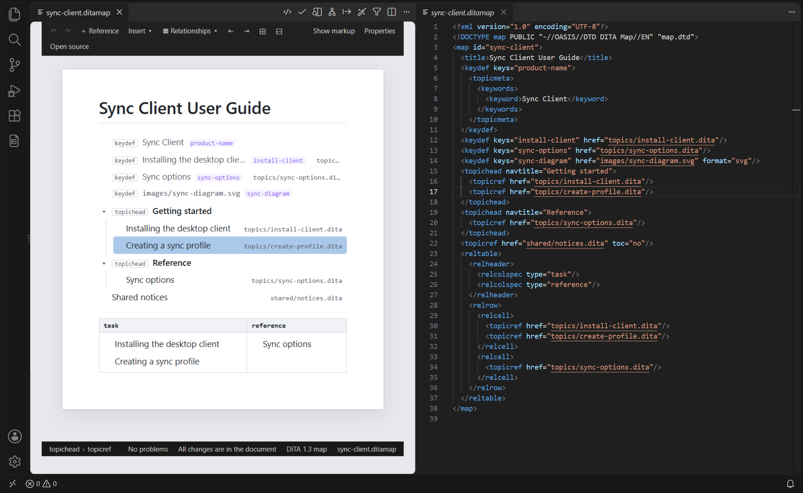
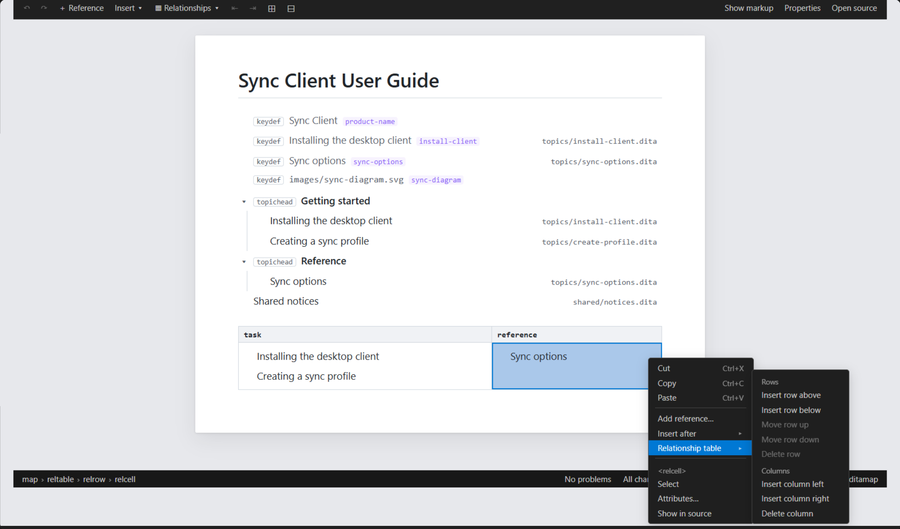

# Visual Editor

The visual editor edits a DITA topic on a page that looks like the [visual preview](VISUAL_PREVIEW.md):
headings, paragraphs, notes, steps, lists, tables. You type on the page; DitaCraft writes the XML.
Maps and bookmaps open in it too, as rows (see [Maps](#maps)).

It is an **alternative editor** for `.dita`, `.ditamap` and `.bookmap` files: the text editor
stays the default.

## Opening it

- In a `.dita`, `.ditamap` or `.bookmap` text editor, click **Open in Visual Editor** in the
  editor title bar, or run **DITA: Open in Visual Editor**.
- Or use **Reopen Editor With… → DITA Visual Editor** (right-click the editor tab), or
  **Open With…** in the Explorer. To make it the default for `.dita` files, choose
  **Configure default editor for '*.dita'…** in that list (likewise for maps).
- **Open Source** (title bar, or **DITA: Open Source**) goes back to the text editor; the toolbar's
  **Open source** opens the text beside the page, at the cursor.

Switching keeps your place: **Open in Visual Editor** puts the page's cursor where the text cursor
was, **Open Source** puts the text cursor where the page's cursor was.

Both views edit the same document: a change in one appears in the other, unsaved changes included.

### Side by side with the text editor

With the text of the same file open beside the page (the toolbar's **Open source**, or **View:
Split Editor**), each follows the other:

- move the cursor in one (click, arrow keys, typing, **Go to…**, a click in the Problems panel):
  the other's cursor moves to the same place and is kept in view;
- scroll one: the other scrolls to the same place (the element at the top of one is at the top of
  the other).

The places match exactly, character by character in text, also after edits. Turn it off with
`ditacraft.previewScrollSync` (it also controls the preview's sync).

## Editing

| You do | DitaCraft writes |
|---|---|
| Type, delete, select and replace text | Only the characters you changed — a paragraph wrapped over several lines keeps its line breaks, `&amp;` and other references stay as written |
| **Enter** in a paragraph or a list item | A new paragraph or item (without the original's `@id`) |
| **Enter** in a step's command | A new `<step><cmd>` |
| **Enter** in an empty last list item | Leaves the list: a paragraph after it |
| **Enter** in the text of a note, table cell, section… | The rest of the text becomes a `
` inside it |
| **Enter** at the end of a title | Starts the short description (or the next paragraph) |
| **Backspace** at the start of a block | Joins it to the previous one |
| **Ctrl+B / Ctrl+I / Ctrl+U / Ctrl+E** | `<b>`, `<i>`, `<u>`, `<codeph>` (toggle) |
| **Tab / Shift+Tab** in a list item | Nests it in the previous item / moves it out (in a table: next / previous cell) |
| **Ctrl+Z / Ctrl+Y** | Undo / redo on the page (also undone in the document) |

The toolbar adds superscript and subscript, bulleted and numbered lists, a **Style** list (turn
the current paragraph into a note, a `lines` block, a code block… — only what the DTD allows
there), **Insert** (every block element the DTD allows after the current block: the common ones
first, then all of them by domain) and **Table** (below).

Elements specialized by your project behave like the element they specialize (a step in your own
task specialization gets the step behaviour).

## Images

**🖼 ▾** in the toolbar (or **Image ▸** in the right-click menu) inserts an image where the cursor
is, as the document type allows there:

- **In the text…** — in the sentence (`<image href="…"/>`);
- **On its own line…** — `placement="break"`: instead of an empty paragraph, else in the paragraph
  at the cursor, else after the current block;
- **In a figure…** — a `<fig>` with the image and an empty title: type the caption.

You pick the file, then type its **alternative text** (read aloud, and shown when the image cannot
be; leave it empty for a decorative image), written as an `<alt>` element. The `href` is relative
to the topic (`../images/diagram.png`, spaces as `%20`).

- **Paste** an image (a screenshot): it is saved next to the topic — in `images/`, named
  `<topic>-1.png`, `<topic>-2.png`… (setting `ditacraft.imagePasteFolder`) — and inserted on its
  own line.
- **Drop** image files from VS Code's Explorer (hold **Shift** while dropping, as for any editor):
  they are inserted where you drop them, linked where they are. Image files dropped from outside VS
  Code are saved like pasted ones.
- On an image (click it, or right-click it): **Replace image…** (another file; an image that took
  its file from a key now uses the file), **Alternative text…**, and in **Properties** its size
  (`width`, `height`, `scale`), `placement` and `align`.
- **Resize** a selected image by dragging the handle on its bottom-right corner: an outline shows
  the new size (its proportions are kept), release to set it (Escape cancels, Ctrl+Z undoes).
  `@width` and `@height` change together in their own units (`2in` stays in inches); an image
  without either gets `@width` in pixels; `@scale` is removed, the size being given.

Images show at their size, alignment and placement, as in the preview. An image given by a key
(`keyref`) shows the file the key gives (hover: the key and the file); a key that is not defined
shows `[key]`, marked.

## Links

**🔗** in the toolbar, **Ctrl+K**, or **Link…** in the right-click menu opens the link picker. Type
to search:

- **In this topic** — the topic and its elements with an `@id` (sections, figures, tables,
  steps…): `href="#topic/element"`;
- **Keys** — the keys of the topic's root map, with their title and file: `keyref="key"`;
- **Topics and maps** — those of the workspace (outside a workspace, of the topic's folder);
  choosing a topic then offers *the topic itself* or one of its elements:
  `href="install.dita#install/prereq"` (relative to this topic; a map gets `format="ditamap"`);
- **Web address…** — or type the address (`https://…`, `mailto:…`) straight in the search box:
  `href="https://…" scope="external" format="html"`.

With text selected, the text becomes the link's text (`<xref href="…">the manual</xref>`);
otherwise an empty link is inserted (`<xref href="…"/>`) — when published its text is the
target's title, which stays right if the title changes. On the page an empty link shows its
target's title as the preview does, and follows it when the title changes, also in another file,
saved or not (hover: where it points). A link whose target cannot be found shows its address,
marked, and says why on hover.

On a link, the same command is **Change link target…**: only `href`/`keyref`, `scope` and
`format` change, the link's text and other attributes stay. The right-click menu also offers
**Open link target** (the file at the element, keys resolved; a web address in the browser) and
**Remove link** (its text stays). A link can only go where the document type allows one (not in a
title, for example).

## Right-click menu

Right-click on the page (or press the **Menu** key, or **Shift+F10**). The cursor moves where you
clicked, unless you clicked inside the selection, which the menu then acts on:

| Item | What it does |
|---|---|
| **Quick Fix…** | On a problem: its fixes (Ctrl+.), see [Quick fixes](#quick-fixes) |
| **Cut / Copy / Paste** | As Ctrl+X / C / V: elements copied in the editor keep their structure and attributes |
| **Insert after ▸** | Every block element the DTD allows after the current block |
| **Insert inline ▸** / **Wrap in ▸** | Every phrase element the DTD allows here (`xref`, `ph`, `uicontrol`, `filepath`, `term`…): around the selected text, or — with nothing selected — with its name as placeholder text, selected so you type over it |
| **Image ▸** | An image in the text, on its own line, or in a figure (see [Images](#images)) |
| **Link… / Change link target… / Open link target / Remove link** | See [Links](#links) |
| **Change to ▸** | What the current paragraph can turn into (as **Style**) |
| **Table ▸** | In a table: the table commands |
| **Open the reused source / Replace with copy** | On reused content |
| **Select / Move up / Move down / Remove tags (keep content) / Delete** | On the element at the cursor (its name is shown above them): select it whole; swap it with the block before or after; remove the element but keep its content in place; delete it |
| **Attributes…** | The Properties view, for that element |
| **Show in source** | The text editor at that place |

Long lists start with the common elements, then group the rest by domain (Base, Highlighting,
Programming, Software, User interface…). The menus follow the document type exactly — `<title>`
offers phrases but no `<xref>`, a `<note>` takes paragraphs and lists but no `<section>` — and an
item that would break the structure is greyed out (deleting a topic's title, moving the title,
removing the tags of a paragraph where text is not allowed).

The keyboard works in every menu: ↑ ↓ to move, → to open a submenu, ← or Escape to close it,
Enter to run, and typing the start of a name jumps to it (`uic` → `uicontrol`).

## Tables

**Table ▾** inserts a CALS table (a header row, column specifications) and, with the cursor in a
cell, edits the table:

| Command | What it writes |
|---|---|
| Insert row above / below | A row with one cell per free column; a cell spanning rows across the new row grows (`morerows`) |
| Delete row | The row; a cell spanning into it shrinks, a cell spanning down from it moves to the next row |
| Insert column left / right | A cell in every row, a new `<colspec>` named like the others (`colnum` renumbered when the table numbers its columns), `@cols` + 1; a cell spanning across the new column widens |
| Delete column | The cells of that column; a cell spanning across it shrinks; the colspec goes, `@cols` − 1 |
| Merge with the cell on the right / below | One cell spanning both (`namest`/`nameend` with colspec names — created if the table has none — or `morerows`), contents joined |
| Split cell | A merged cell becomes one cell per slot again (its content stays in the first) |
| Header row on/off | The first body row becomes the header row (`thead`), or back |

**Tab** and **Shift+Tab** move to the next and previous cell (Tab in the last cell adds a row). In
a simple table (`simpletable`) rows, columns and the header row work the same way, and
`@relcolwidth` follows column changes. A command that would break the table (deleting the last
body row, merging cells of different heights) is not offered.

Rows and cells that a command does not change are written back as they were.

**Column widths.** Tables show their column widths (`colspec/@colwidth`, a simple table's
`@relcolwidth`), as in the preview. Drag the border between two columns to move width from one to
the other: a guide line shows the two new widths, release to set them (Escape cancels, Ctrl+Z
undoes). Proportional widths are written as whole numbers out of 100 (`30*`, `70*`); a table whose
proportions do not add up to 100 has them rewritten that way the first time, after that only the
two columns change. Fixed widths (`50pt`, `2cm`…) keep their unit. A CALS table without colspecs
gets them (`<colspec colname="c1" colnum="1" colwidth="…"/>`).

## Reused content

Reused content (`conref`, `conkeyref`) shows in a box: its source above, then the reused
content as the preview shows it (keys, `conrefend` ranges, reuse of reused content and images
resolved), read only. It follows changes in the reused file, saved or not. Reuse that cannot be
resolved (a missing file, element or key) shows why. Click the box: a bar offers

- **Open source** — opens the reused element in its own file, at the element (keys, `conrefend`
  ranges and reuse of reused content are followed as in the preview);
- **Replace with copy** — replaces the reference with a copy of what it reuses, to change it in
  this topic only. **Ctrl+Z** on the page puts the reference back.

The copy is what DITA's conref resolution gives: the element keeps its own attributes and takes
the reused element's other attributes (not its `@id`); a `-dita-use-conref-target` value takes the
reused value; a `conrefend` range becomes every element of the range. In the copy, relative
references (`href`, `conref`, images…) are rewritten so they still point to the same files, and an
`@id` the topic already uses is dropped. The copy is written in the file's layout; comments
between the copied blocks are not copied (comments inside a paragraph are).

## Properties (attributes)

The **Properties** view in the DitaCraft side bar (**DITA: Show Properties**, or **Properties** in
the visual editor's toolbar) lists the attributes of the element at the cursor. It follows the
active DITA editor — the visual editor *and* the text editor (topics and maps).

- The breadcrumb at the top shows the elements around the cursor; click one to edit an ancestor.
- Attributes come from the document type: every attribute the element may carry is listed, grouped
  as **Identity and reuse** (`id`, `conref`, `keyref`, `href`…), **Profiling** (`audience`,
  `platform`, `product`, `otherprops`, `props`, `deliveryTarget` and your own `props`
  specializations), **Common** (`outputclass`, `xml:lang`, `rev`, `status`, `importance`…),
  **Element** (attributes specific to the element, e.g. a note's `type`, a table's `frame`) and
  **Architecture** (`@class`, `@domains`, read-only).
- Enumerated attributes are drop-down lists; defaults are shown; required ones are marked `*`.
- Profiling attributes offer the values of your subject scheme (from the map the topic belongs
  to): type them, pick one from the suggestions, or add one with **+**.
- Type a value and press Enter (or leave the field) to set it; clear it or click **×** to remove the
  attribute; Escape cancels.
- Values are checked first: an `id` must be a valid token and unique in its scope (topic ids in
  the document, element ids in their topic), an enumerated value must be one of the list.

A change edits only that attribute in the element's start tag: other attributes stay as written,
and a start tag laid out over several lines keeps its layout. In the visual editor the change is
an ordinary editing step (Ctrl+Z on the page undoes it); in the text editor it is a text edit.

## Problems

The language server's problems (the ones in the **Problems** panel: DTD validation, DITA rules,
references, your custom rules) are marked on the page as you edit:

- a problem in the text of a paragraph underlines that text (wavy: red for errors, orange for
  warnings, blue for information);
- a problem on an element — in its start tag (an attribute such as a duplicate `@id`), or on an
  element shown as a box (reused content, a link, an image) — marks the element.

Hover a mark for its messages. With the cursor in a mark, the status line shows the message; the
problem count next to it goes to the next problem. Marks move with the text while you type and
are refreshed when the language server checks the document again (a moment after you stop).

### Quick fixes

With the cursor in a mark, **Ctrl+.**, **Quick Fix…** at the top of the right-click menu, or a click
on the message in the status line lists the fixes VS Code offers for that problem — the same as
the light bulb in the text editor: the language server's (add the missing `<alt>`, `<title>` or
`@id`, make a duplicate `@id` unique, remove an empty element, add `@otherrole`, turn `@alt` into
`<alt>`…) and **Fix with DitaCraft AI** when AI is set up. The recommended fix is marked ★.

A fix that only changes this topic is made on the page, like your own edits: **Ctrl+Z** on the
page takes it back, and only what it changes is rewritten (a new empty element is written
`<title/>`, the way the editor writes new elements). A fix the page cannot make — one before the
root element such as **Add DOCTYPE**, a command such as **Fix with DitaCraft AI**, or one that
changes other files — is applied to the document directly; the page then follows the document as
after a change in the text editor (which resets its undo; the text editor's undo still has it).

## Maps

A map (or a bookmap) opens as its title, then one row per reference — `topicref` and every
element specialized from it: `chapter`, `part`, `appendix`, `keydef`, `topichead`,
`topicgroup`, `mapref`… — with the rows a reference holds indented under it. A row shows:

| | |
|---|---|
| **Label** | the `<navtitle>` of its `<topicmeta>`, else its `@navtitle`, else the title of the topic or map it points to (read from that file, or through the key for `keyref`; it follows changes to that file, saved or not), else a text key's `<keyword>`, else the target as written |
| **Kind** | the element, except for a plain `topicref` |
| **Keys** | the keys it defines (`@keys`) |
| **Target** | `href` or `[keyref]`, as written, on the right |

A target that cannot be read (a missing file, an undefined key) is marked, with the reason in
its tooltip. A web address or another format (`format="pdf"`) is shown as written. The
`<topicmeta>` of a reference and a book's `<bookmeta>` are hidden: **Show markup** shows them under
their rows, where they can be edited.

- **Click** a row to select it: the **Properties** view shows its attributes (set `href`,
  `navtitle`, `keys`, `toc`, `processing-role`… there).
- **Double-click**, **Ctrl+click**, **Enter** or **Open target** (right-click menu) opens what
  the row points to beside the map — the topic at its element, the submap, through the key for
  `keyref` — or, for another format, the file in VS Code's editor for it.
- The **arrow** before a row folds and unfolds the rows under it; **Expand all** and **Collapse
  all** are on the toolbar. Folding is the page's own: it does not change the map.
- With a row selected: **↑ / ↓** go to the previous / next row shown, **←** folds the row (or goes
  to the row above it), **→** unfolds it (or goes to its first row). Typing does nothing on a row.
- Problems on a reference (a missing target, an attribute) mark its row; quick fixes work as in a
  topic.
- Relationship tables are shown as tables, their cells' references as rows (see
  [Relationship tables](#relationship-tables)).

### Editing the map

- **Add reference…** (toolbar **＋ Reference**, or the right-click menu) opens the target picker —
  the keys of the root map, the topics and maps of the workspace, a web address — and adds a
  reference to the one you choose after the selected row (or after the title). It is a
  `topicref`, or the selected row's own kind where that is what the DTD allows there (a
  `chapter` after a chapter in a bookmap); a map gets `format="ditamap"`, a key `keyref`. The
  new row is selected, with the title of its target.
- **Change target…** (**Ctrl+K**, or the right-click menu) points the selected row somewhere else
  with the same picker: its `href` or `keyref`, `scope` and `format` change, its other
  attributes stay.
- **Edit label** (**F2**, or the right-click menu) edits the label on the row's line; **Enter** (or
  leaving the field) writes it, **Escape** cancels. It is written as the row's navigation title:
  its `<topicmeta>/<navtitle>` (made when missing), or its `@navtitle` when that is how the row
  has it. A row that points to a topic also gets `locktitle="yes"`, so the published navigation
  shows your label rather than the topic's title. An empty label removes the navigation title:
  the row shows the topic's title again.
- **Tab** puts the selected row (with the rows it holds) into the row before it, as its last row;
  **Shift+Tab** takes it out, right after the row that held it (also **⇥ / ⇤** on the toolbar and
  **Indent** / **Outdent** in the right-click menu).
- **Drag** a row by its line: a line shows where it goes — before or after the row under the
  pointer, under the line of a row showing its rows, or into a row (outlined) — wherever the DTD
  allows it. Release to move it, **Escape** to cancel.
- **Insert** (toolbar or right-click menu) adds, after the selected row, any element the DTD allows
  there (`topicref`, `topichead`, `keydef`, `mapref`…); the new row is selected, ready for its
  attributes. **Move up**, **Move down** and **Delete** in the right-click menu work on the row.

A moved row keeps everything it holds, and its source is moved as written, re-indented for its new
place; the rest of the map does not change. Everything is undone with **Ctrl+Z**.

The toolbar of a map has what maps need: undo, redo, **＋ Reference**, **Insert**,
**▦ Relationships**, **⇤ / ⇥**, **Expand all**, **Collapse all**, **Show markup**, **Properties** and
**Open source**.

### Relationship tables

A `<reltable>` is a table: its column headers show the type of topics each column relates
(`<relcolspec type="…">`; set it in the **Properties** view, with the column header selected), and
each cell holds references, shown as rows — the topics related to those in the other cells of the
row. An empty cell says so.

- **Insert relationship table** (**▦ Relationships** on the toolbar, or **Insert ▸ reltable**) adds
  a table with a header of three columns and one row, after the selected row where the DTD allows
  it, else at the end of the map; its first cell is selected.
- **Click** a cell's empty space (or a column header's type) to select the cell. With a cell
  selected, the arrow keys go to the cell above, below, left or right, **Tab** / **Shift+Tab** to the
  next / previous cell (**Tab** past the last cell adds a row), and **Enter** (or **Add
  reference…**) adds a reference into the cell from the picker.
- **Relationship table ▸** (right-click in a table, or **▦ Relationships**): **Insert row above /
  below**, **Move row up / down**, **Delete row**, **Insert column left / right**, **Delete column**.
  A new row has a cell for every column; a column is added or deleted with its header and its cell
  in every row, so the table stays a grid. A table keeps one row and one column at least.
- **Drag** a reference into a cell (onto its empty space): it goes at the end of the cell. Rows in
  cells are moved, nested, relabelled and retargeted like any other row.
- A cell, a row of cells or the header is not moved, inserted or deleted on its own (the generic
  **Move** / **Delete** / **Insert after** items leave them out): the table's commands do it.

### Map context

A topic is often used in a map — or in several maps, or several times in one map with different
keys (`@keyscope`). The visual preview and the visual editor show a topic **in a place of a map**:
its map context, shown on the status line (**🗺 Sync Client User Guide › Getting started**: the root
map's title and the navigation above the topic).

- **Keys** resolve in that map's key space, in the key scope of the reference: the same topic shows
  "Alpha" in the `prodA` scope and "Beta" in the `prodB` scope. Reused content's keys and keyed
  images too; the link picker offers that map's keys.
- **Metadata** the map gives the topic (DITA's cascading): its language — generated text such as
  note labels follows the topic's `xml:lang`, else the map's, else VS Code's — and its profiling
  attributes: when the active DITAVAL filter excludes the topic in that place (a reference with
  `audience="admin"` under a filter excluding `admin`), the preview says so in a banner.
- **Which place**: the first one found — maps that no other map references are root maps, searched
  through their submaps, the project's root map (`ditacraft.rootMap`) first — unless you choose
  one: click the status line item, or run **DITA: Choose Map Context**, and pick a place (with its
  root map, submaps and key scope), **Automatic**, or **No map context** (keys from the nearest root
  map, as elsewhere in DitaCraft). **Open target** on a map's row in the visual editor also shows the
  topic in that row's place. Choices are kept per topic in the workspace.
- References in relationship tables, key definitions and resource-only references are not places.

## What is kept as written

Some content is shown but not edited on the page in this release; it is kept byte for byte, and
you edit it in the source:

- prolog metadata, index terms, `data`, draft comments, comments and processing instructions
  (shown with **Show markup**);
- images, footnotes, related links, objects, MathML and SVG;
- reused content (`conref`, `conkeyref`) — shown in a box with its content, see
  [Reused content](#reused-content) — phrases whose text comes from a key
  (`<keyword keyref="…"/>`) and empty links (`<xref href="…"/>`): shown with the key's text or
  the target's title, as on the preview (`[key]` or the address, marked, when they cannot be
  resolved);
- named entity references such as `&product;` (shown with their value, never rewritten);
- elements the document type does not declare.

Copying and pasting inside the editor keeps elements and attributes (pasted copies get no `@id`).
Pasted HTML from other applications becomes paragraphs, lists, code blocks and bold/italic/code.

## How changes reach the file

Each change on the page becomes one small text edit of the VS Code document — the same as
typing in the text editor. So the dirty marker, **Save**, auto-save, Git diffs, the language
server's validation and the text editor's own undo all work as usual, and a Git diff shows only
what you changed.

- A structure that does not follow its DTD (a topic still without its title) is edited all the
  same; the language server reports the problem, and the page marks it (see [Problems](#problems)).
- While the XML is not well-formed (you are typing a tag in the text editor), the page shows the
  last good version, a banner names the error, and editing waits until the XML is fixed.
- A change made in the text editor while the page is open replaces the page's undo history (the
  text editor's undo still covers everything).

## Settings

The page follows the preview's settings: `ditacraft.previewTheme`, `ditacraft.previewPageWidth`,
`ditacraft.previewShowMarkup`, `ditacraft.previewCustomCss` (the editor uses the same DITA-OT
class names as the preview, so a stylesheet written for the preview styles the editor too) and
`ditacraft.previewScrollSync` (sync with the text editor).

## Not yet

- Maps: a topic referenced through a key only (`<topicref keyref="…"/>`) is not found as a place.

## For contributors

| Part | Location |
|---|---|
| Grammar → ProseMirror schema (element variants, marks, presentation) | `src/shared/editor/schema.ts` |
| Source → editor document, with the source map of every node | `src/shared/editor/toProseMirror.ts` |
| Editor document → source (lossless writer) | `src/shared/editor/toSource.ts` |
| DITA editing commands (also phrase insertion and element actions) | `src/shared/editor/commands.ts` |
| Menus as data (right-click, toolbar Insert, Table and Image), domain grouping | `src/shared/editor/contextMenu.ts` |
| Images: placements, insertion, alt text, file replacement, resize; host file helpers (hrefs, pasted images); the resize handle on the page | `src/shared/editor/images.ts`, `src/editor/imageFiles.ts`, `webview/editor/imageResize.ts` |
| Links: commands (page); targets and picker items; the picker and Open link target (host) | `src/shared/editor/links.ts`, `src/editor/linkTargets.ts`, `src/editor/linkPicker.ts` |
| Menu rendering and keyboard on the page | `webview/editor/menu.ts` |
| Child elements the DTD allows in mixed content (`childSets`) | `src/shared/grammar/compiler.ts`, `EditorSchema.allows` |
| Table commands (CALS grid, simple tables) | `src/shared/editor/tables.ts` |
| Column widths: parsing, display, drag results; the drag on the page | `src/shared/editor/columnWidths.ts`, `webview/editor/columnResize.ts` |
| Replace with copy: the copy (host), new content from source (page) | `src/editor/reuseCopy.ts`, `buildFragment` in `src/shared/editor/toProseMirror.ts` |
| Resolved references — reused content in its box, keys' texts, link targets' titles, key images: resolution (host), offsets → elements, the views (page) | `src/editor/reusedContent.ts`, `src/shared/editor/reused.ts`, `webview/editor/reusedView.ts` |
| Problem marks: diagnostics' offsets → marks on the page's document | `src/shared/editor/problems.ts` |
| Maps: rows (labels, targets, DOM), row selection; titles of rows' targets (host); the row view, folds and row keys (page) | `src/shared/editor/maps.ts`, `resolveMapReference` in `src/preview/resolver.ts`, `mapRowItems` in `src/editor/reusedContent.ts`, `webview/editor/mapView.ts` |
| Maps: editing rows — move (indent, outdent, drop), target, new reference, label (navtitle, locktitle); the picker's map mode; moved elements re-indented | `src/shared/editor/mapCommands.ts`, `pickLinkTarget(…, 'map')` in `src/editor/linkPicker.ts`, `placed` in `src/shared/editor/toSource.ts` |
| Maps: relationship tables — the grid (rows, columns, cells), cell keys; the cell view and drops into cells (page) | `src/shared/editor/relTables.ts`, `MapCellView` in `webview/editor/mapView.ts` |
| Map context of a topic: places, trail, scope, inherited metadata; the choice per topic, keys through it | `src/preview/mapContext.ts`, `src/preview/mapContexts.ts`, `KeySpaceResolver.resolveKeyInMap` |
| Quick fixes: a text change (a fix's edits) as a change of the page's document, checked; listing and applying fixes (host) | `src/shared/editor/sourceChange.ts`, `src/editor/visualEditorProvider.ts` |
| Page positions ↔ source offsets (sync with the text editor, handoffs) | `src/shared/editor/sourcePositions.ts` |
| Edit synchronization, minimal span edit | `src/shared/editor/sync.ts`, `minimalEdit.ts` |
| Custom editor host | `src/editor/visualEditorProvider.ts`, `src/editor/messages.ts` |
| Page script and stylesheet | `webview/editor/` (bundled to `out/webview/editor.js`) |
| Properties: attribute model, value checks, id scoping | `src/shared/editor/properties.ts` |
| Properties: in-place start-tag edits | `src/shared/cst/openTag.ts` |
| Properties view (host, page) | `src/properties/`, `webview/properties/` |

`npm run test:shared` runs the editor suites with plain Mocha: no-op round trip over the corpus,
typing/deleting fuzzed over every text node (each must change exactly one character's source),
random sequences of edits and DITA commands that must read back as the edited document,
random table command sequences that must leave a valid CALS grid, random structure edits on the
rows of the corpus maps, and the command, menu, map and sync tests. `DITACRAFT_FUZZ_SEED`, `DITACRAFT_FUZZ_RUNS` and
`DITACRAFT_FUZZ_STEPS` run the edit fuzz harder. `src/test/suite/visualEditor.test.ts` drives
the real page inside VS Code.
